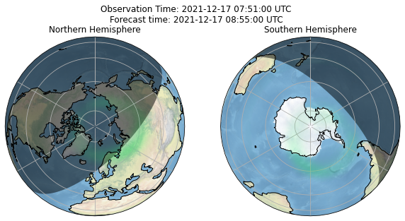
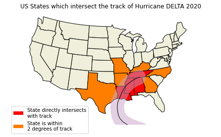
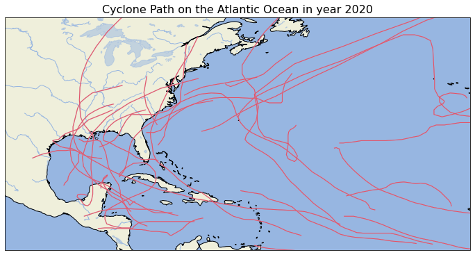

# Geospatial data visualization

Using the package [Cartopy](https://scitools.org.uk/cartopy/docs/latest/index.html) to visualize some geospatial data. Data achieved from National Oceanic and Atmospheric Administration ([NOAA](https://www.noaa.gov/)).

<h2> Aurora Forcast Visualization </h2>

Visualization of real time aurora forecast projected on the Northern and Southern Hemisphere.

<h2> Tropical Cyclone Visualization</h2>

<h3> A specific cyclone path</h3>

Visualization of a specific cyclone path and its intersection with the US.

<h3> Path on the Atlantic Ocean in a year</h3>

Visualization of all the cyclone paths on the Atlantic Ocean.

